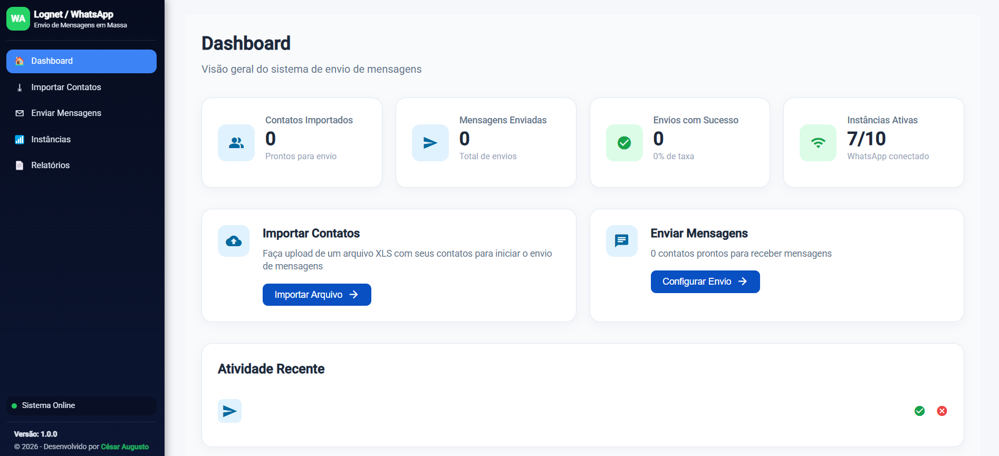
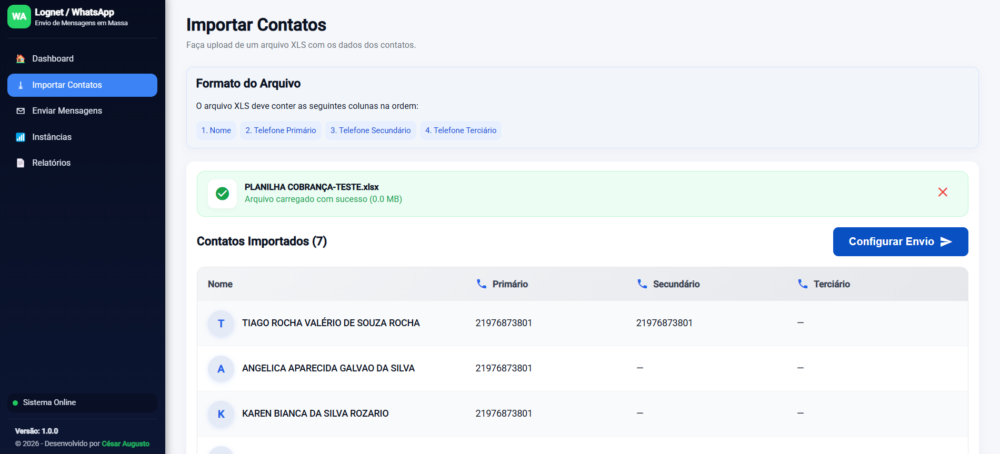
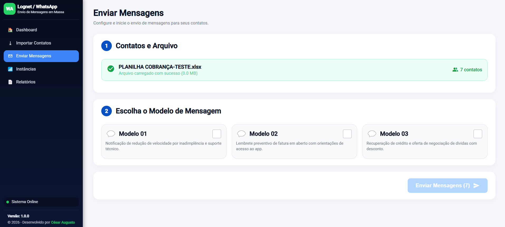
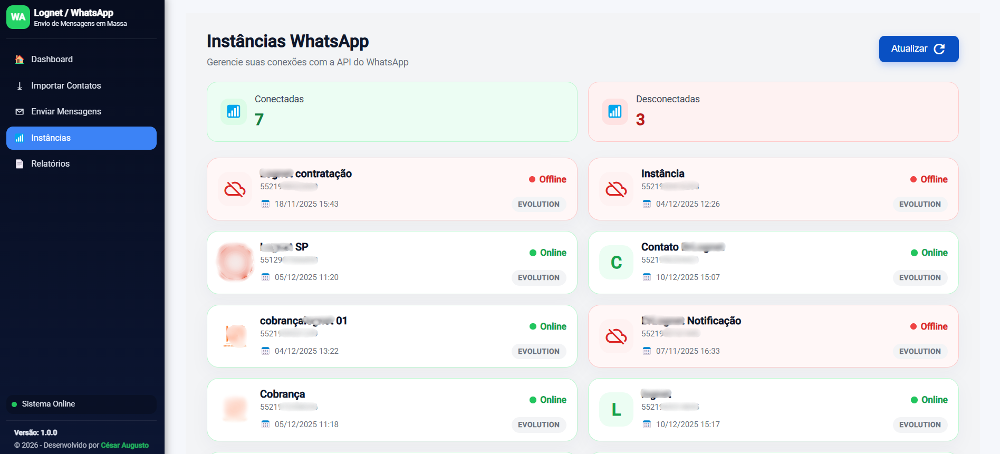

# 📱 WhatsApp Sender - Sistema de Envio de Mensagens em Massa

Sistema web completo para envio automatizado de mensagens em massa via WhatsApp, desenvolvido com Angular 19 e integração com N8N.

## 🎯 Sobre o Projeto

O WhatsApp Sender é uma aplicação robusta que permite o envio de mensagens personalizadas em massa através do WhatsApp. Com uma interface moderna e intuitiva, o sistema facilita a importação de contatos via planilhas XLS, gerenciamento de modelos de mensagens e acompanhamento detalhado dos envios através de relatórios completos.

## 📸 Screenshots

### Dashboard - Visão Geral

*Painel principal com métricas em tempo real, cards de ações rápidas e atividade recente*

### Importação de Contatos

*Interface de upload de arquivos XLS com pré-visualização e validação de contatos*

### Configuração de Envio

*Seleção de modelos de mensagem com pré-visualização do conteúdo*

### Gerenciamento de Instâncias

*Monitoramento de conexões WhatsApp com status online/offline em tempo real*

### Relatórios Detalhados

*Acompanhamento completo de envios com métricas de sucesso e erro*

## ✨ Funcionalidades Principais

- **📊 Dashboard Interativo**: Visão geral com métricas de contatos, envios, taxa de sucesso e status das instâncias
- **📥 Importação de Contatos**: Upload de arquivos XLS/XLSX com suporte a múltiplos telefones por contato
- **💬 Modelos de Mensagem**: Sistema de templates personalizáveis para diferentes tipos de comunicação
- **🚀 Envio em Massa**: Processamento automatizado com feedback em tempo real
- **📱 Gerenciamento de Instâncias**: Monitoramento de conexões WhatsApp com status online/offline
- **📈 Relatórios Detalhados**: Acompanhamento completo com detalhes de sucesso e erros por envio
- **🎨 Interface Moderna**: Design responsivo e amigável com Material Icons

## 🛠️ Tecnologias Utilizadas

### Frontend
- **Angular 19** - Framework principal
- **TypeScript 5.9** - Linguagem de programação
- **RxJS 7.8** - Programação reativa
- **Angular Signals** - Gerenciamento de estado
- **SCSS** - Estilização avançada
- **Material Icons** - Biblioteca de ícones

### Bibliotecas
- **XLSX (0.18.5)** - Processamento de planilhas Excel
- **Angular Material (20.2.14)** - Componentes UI
- **Angular CDK (20.2.14)** - Utilitários de desenvolvimento

### Backend/Integração
- **N8N** - Automação e processamento de envios
- **API RESTful** - Comunicação com backend

## 📋 Pré-requisitos

- Node.js (versão 18 ou superior)
- npm ou yarn
- Angular CLI (`npm install -g @angular/cli`)
- Backend/N8N configurado e rodando

## 🚀 Instalação e Configuração

### 1. Clone o repositório
```bash
git clone https://github.com/seu-usuario/whatsapp-sender.git
cd whatsapp-sender
```

### 2. Instale as dependências
```bash
npm install
```

### 3. Configure o ambiente
Crie o arquivo `src/environments/environment.ts`:

```typescript
export const environment = {
  production: false,
  apiUrl: 'https://sua-url-do-backend.com/webhook/message-api'
};
```

Para produção, configure `src/environments/environment.prod.ts`:

```typescript
export const environment = {
  production: true,
  apiUrl: 'https://sua-url-de-producao.com/webhook/message-api'
};
```

### 4. Execute o projeto
```bash
npm start
```

A aplicação estará disponível em `http://localhost:4200`

## 📦 Build para Produção

```bash
npm run build
```

Os arquivos de produção serão gerados no diretório `dist/`

## 📱 Estrutura do Projeto

```
src/
├── app/
│   ├── core/
│   │   ├── guards/          # Guards de roteamento
│   │   └── services/        # Serviços da aplicação
│   │       ├── arquivo-upload.service.ts
│   │       ├── contatos.ts
│   │       ├── instancias.ts
│   │       ├── mensagens.ts
│   │       └── relatorios.ts
│   ├── layout/
│   │   ├── main-layout/     # Layout principal
│   │   └── sidebar/         # Barra lateral de navegação
│   ├── pages/
│   │   ├── dashboard/       # Página inicial
│   │   ├── importar-contatos/
│   │   ├── enviar-mensagens/
│   │   ├── confirmar-envio/
│   │   ├── instancias/
│   │   └── relatorios/
│   ├── app.config.ts        # Configurações do app
│   └── app.ts               # Componente raiz
├── environments/            # Configurações de ambiente
└── styles.scss             # Estilos globais
```

## 🎨 Formato do Arquivo de Importação

O arquivo XLS deve conter as seguintes colunas na ordem:

| Coluna | Descrição | Obrigatório |
|--------|-----------|-------------|
| Nome | Nome do contato | ✅ Sim |
| Telefone Primário | Número principal (com DDD) | ✅ Sim |
| Telefone Secundário | Número alternativo | ❌ Não |
| Telefone Terciário | Número adicional | ❌ Não |

**Exemplo:**
```
Nome              | Telefone Primário | Telefone Secundário | Telefone Terciário
João Silva        | 21987654321      | 21912345678        |
Maria Santos      | 11987654321      |                    |
```

## 🔧 Principais Funcionalidades por Módulo

### Dashboard
- Visão geral de métricas
- Contatos importados
- Taxa de sucesso de envios
- Status de instâncias
- Atalhos rápidos para ações principais

### Importar Contatos
- Upload de arquivos XLS/XLSX
- Pré-visualização dos contatos
- Validação de dados
- Paginação de contatos

### Enviar Mensagens
- Seleção de modelo de mensagem
- Pré-visualização do conteúdo
- Confirmação antes do envio
- Indicador de progresso

### Instâncias
- Listagem de conexões WhatsApp
- Status online/offline em tempo real
- Informações de perfil
- Data de criação

### Relatórios
- Listagem de todos os envios
- Detalhamento por envio
- Status (Processando, Concluído, Com Erros, Falha)
- Contadores de sucesso e erro
- Polling automático a cada 10 segundos

## 🤝 Contribuindo

Contribuições são bem-vindas! Para contribuir:

1. Faça um fork do projeto
2. Crie uma branch para sua feature (`git checkout -b feature/MinhaFeature`)
3. Commit suas mudanças (`git commit -m 'Adiciona MinhaFeature'`)
4. Push para a branch (`git push origin feature/MinhaFeature`)
5. Abra um Pull Request

## 📝 Licença

Este projeto está sob a licença MIT. Veja o arquivo [LICENSE](LICENSE) para mais detalhes.

## 👨‍💻 Desenvolvedor

**César Augusto**
- Portfolio: [portfolio.cesaravb.com.br](https://portfolio.cesaravb.com.br/)
- GitHub: [@cesaravb](https://github.com/cesaravb)
